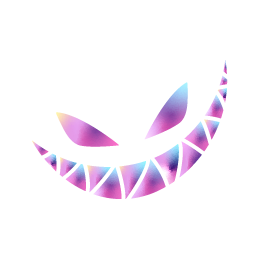

 

# Assets for [@LovverHub][website-link]

Forging ahead into the frontier of innovative thought and creativity. Crafted with you in mind, the Extraordinary Individual.

<h6 align="center">
  <a href="https://github.com/lovverhub/lovver-assets/blob/master/assets/banners">Banners</a>
  ·
  <a href="https://github.com/lovverhub/lovver-assets/blob/master/assets/footers">Footers</a>
  ·
  <a href="https://github.com/lovverhub/lovver-assets/blob/master/assets/logos">Logos</a>
  ·
  <a href="https://github.com/lovverhub/lovver-assets/blob/master/assets/favicons">Icons</a>
</h6>

  

## 📦 Packages

| NAME                        | NPM                                                           | UNPKG                                  |
| --------------------------- | ------------------------------------------------------------- | -------------------------------------- |
| @lovverhub/images-optimizer | [![][images-optimizer-release]][images-optimizer-release-url] | [ALIYUN-UNPKG][images-optimizer-unpkg] |

## 🎨 Assets

|  |  |  |  |
| --------------------------------------------------- | ------------------------------------------------------------ | ------------------------------------------------------------- | -------------------------------------------------------------------------- |
| [Logo 3D][logo-3d]                                  | [Logo Dark][logo-dark]                                       | [Logo Light][logo-light]                                      | [Logo Combine][logo-combine]                                               |
| webp                                                | webp                                                         | webp                                                          | webp                                                                       |

	

	Copyright &copy; 2023-present <a href="https://github.com/lovverhub" target="_blank">LovverHub Inc.</a>

	

[images-optimizer-release]: https://img.shields.io/npm/v/@lovverhub/images-optimizer?colorA=363a4f&colorB=f5a97f&style=for-the-badge&logo=npm
[images-optimizer-release-url]: https://www.npmjs.com/package/@lovverhub/images-optimizer
[images-optimizer-unpkg]: https://registry.npmmirror.com/@lovverhub/images-optimizer
[logo-3d]: assets/logos/lovver-3d.webp
[logo-dark]: assets/logos/lovver-simple-dark.webp
[logo-light]: assets/logos/lovver-simple-light.webp
[logo-combine]: assets/palette/royale-blade/logo-combine-dark.webp
[website-link]: https://www.lovver.us
